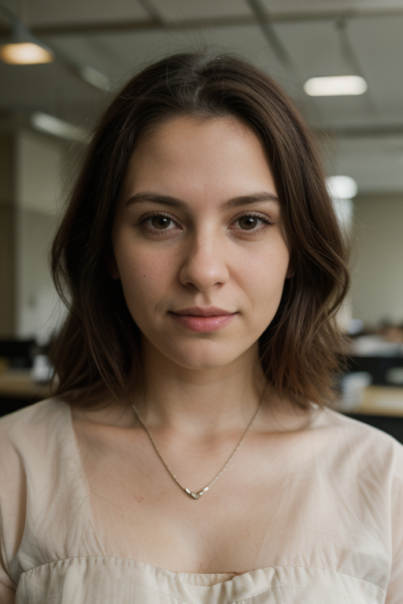
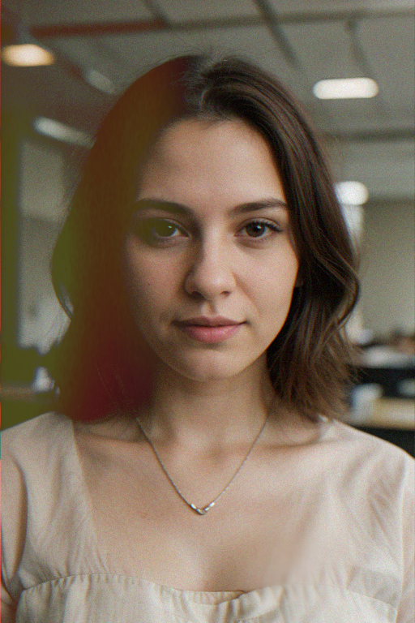
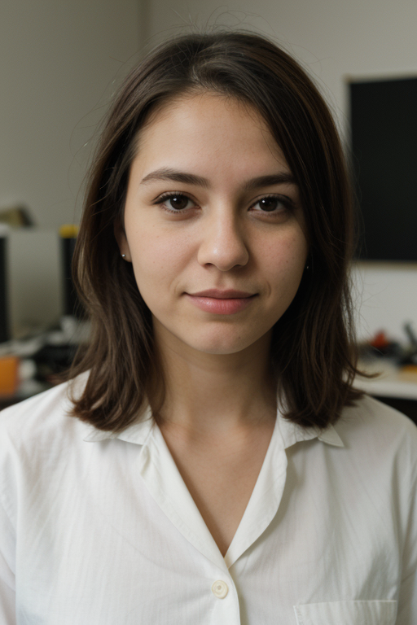
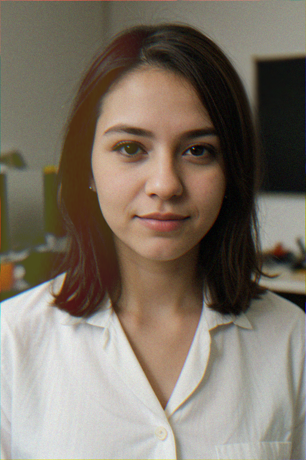
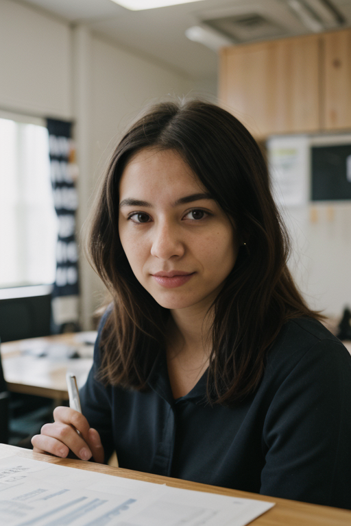
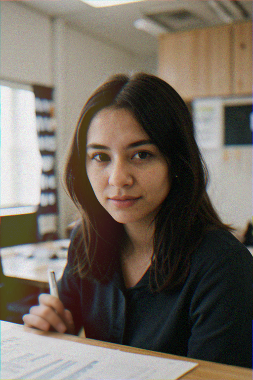

# a1111-Advanced-Image-Effects
Adds post-processing image effects to Stable Diffusion outputs, creating a vintage aesthetic. Grain, vignette, random blur, color offset, and customizable overlays like light leaks.

# Advanced Image Effects for Stable Diffusion Web UI

This script adds advanced image effects to the Stable Diffusion Web UI, allowing users to apply various post-processing effects to generated images.

## Features

- Grain effect
- Vignette
- Random blur
- Color offset
- Image overlay
- Option to save original images

## Installation
Main installation method should soon be the extension panel of automatic1111.

But for now:
1. Clone this repository or download the script.
2. Place the script in the `extension` folder of your Stable Diffusion Web UI installation.
3. (Optional) Add overlays to the `overlays` folder in the same directory as the script and add any overlay images you want to use.

## Usage

1. Run the Stable Diffusion Web UI.
2. In the "Script" dropdown menu, select "Advanced Image Effects".
3. Adjust the settings for the desired effects.
4. Generate your image as usual.

## Effect Examples

Here are some general examples of how the Advanced Image Effects can transform your generated images:

Before | After
-------|------
 | 
 | 
 | 

## Settings

- **Save Original Image**: When enabled, saves the original image before applying effects.
- **Enable Grain**: Adds film grain to the image.
- **Enable Vignette**: Applies a vignette effect to the edges of the image.
- **Enable Random Blur**: Adds a random blur to a portion of the image.
- **Enable Color Offset**: Shifts color channels for a chromatic aberration effect.
- **Enable Overlay**: Applies an image overlay to the generated image.

Each effect has additional parameters for fine-tuning:

- Grain Intensity
- Vignette Intensity, Feather, and Roundness
- Blur Max Size and Strength
- Color Offset X and Y
- Overlay File, Fit, Opacity, and Blend Mode

## Troubleshooting

If you encounter issues with overlay images not being found:

1. Check that your overlay images are in the correct directory.
2. Ensure overlay filenames are correctly entered in the UI.
3. Check the console output for any error messages related to file paths.

## Contributing

Contributions are welcome! Please feel free to submit a Pull Request.

## License

This project is licensed under the Apache License 2.0.

The Apache 2.0 license is a permissive open source license that allows you to:

- Use the software for any purpose
- Modify and distribute the software
- Distribute modified versions under any license of your choice

It also provides an express grant of patent rights from contributors to users.

Key requirements include:

- Including a copy of the license in any redistribution
- Clearly stating any significant changes made to the software
- Retaining copyright notices

For the full license text, see the [LICENSE](LICENSE) file in this repository or visit [Apache License 2.0](https://www.apache.org/licenses/LICENSE-2.0).

## Acknowledgements

This script is designed for use with the [Stable Diffusion Web UI](https://github.com/AUTOMATIC1111/stable-diffusion-webui) by AUTOMATIC1111.
